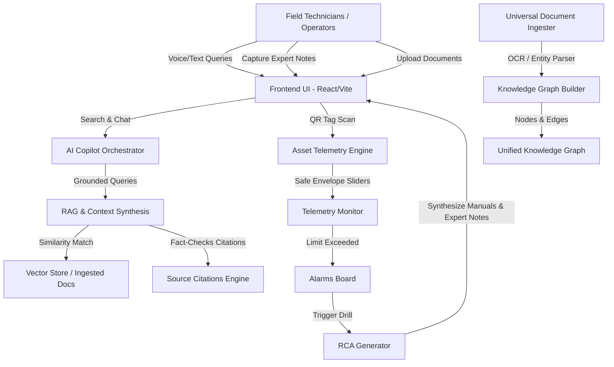

# 🧠 Industrial Knowledge Intelligence Hub (IKIP)
> **Theme:** Industrial Intelligence / Document Management / Knowledge Engineering / Quality  
> **Challenge Track 8:** Unified Asset & Operations Brain

An enterprise-grade, stateful AI simulation platform built to solve the **"Knowledge Cliff"** and **"Information Silo"** crises in heavy industry. The platform unifies legacy document repositories, expert tacit knowledge, real-time sensor telemetry, and compliance frameworks into a single, connected, conversational brain.

---

## 🚀 What is this Project? (The Core Concept)

In heavy industries (manufacturing, power plants, steel mills, oil & gas), **35% of an engineer's time is wasted searching for information** scattered across isolated silos: P&IDs, OEM equipment manuals, historical work orders, regulatory compliance standards, and emails. Worse, **25% of senior operators are retiring in the next decade**, taking years of undocumented operational experience (tacit knowledge) with them.

**IKIP** acts as the **Unified Asset & Operations Brain** that:
1. **Preserves Retiring Experts' Knowledge:** Capture voice notes or transcripts from senior personnel and link them directly to asset tags.
2. **Ingests Siloed Documents:** Processes PDFs, manuals, and reports, run simulated OCR, extracts tags, and links them to the ontology.
3. **Builds a Knowledge Graph:** Represents connections between assets, manuals, maintenance records, and regulations.
4. **Delivers Grounded RAG Search (No Hallucinations):** Engineers query the system using text or speech. The copilot retrieves answers with exact citations and confidence scores.
5. **Drives Predictive Maintenance & RCA:** Fuses sensor telemetry (vibration, temperature) with manuals and expert logs to trigger alarms and auto-generate Root Cause Analysis reports.
6. **Ensures Regulatory Audit Readiness:** Automatically checks compliance gaps against statutory norms (OISD, Factory Act) and compiles evidence packages.

---

## 🛠️ System Architecture



---

## 📂 Features & User Journeys (How to Use and Demo)

Open **`http://localhost:3000/`** in your browser to run the live demo. Follow these step-by-step scenarios to wow judges:

### 1. 🎙️ Expert Knowledge Capture (Solving the "Silver Tsunami")
*   **Path:** `/experts` (Expert Capture)
*   **What it does:** Allows senior engineers to dictate warnings or tips about specific equipment.
*   **How to use:**
    1. Select an equipment tag (e.g., `P-101` - Primary Centrifugal Pump).
    2. Click **"Capture Knowledge"**.
    3. Click **"Simulate Mic Speech"** (or use your own mic) to auto-type an engineer's note about pump cavitation or valve settings.
    4. Click **"Store Note"**. It is now registered in the global state.

### 2. 📄 Universal Document Ingestion
*   **Path:** `/documents` (Document Ingestion)
*   **What it does:** Simulates document processing (OCR, entity extraction, structural categorization).
*   **How to use:**
    1. Drop a text or pdf file into the uploader area.
    2. Watch the status transition in real-time from *Queued* -> *Processing* -> *Processed*.
    3. The parser automatically extracts tags (like `P-101` or `OISD-102`) and updates the system indexes.

### 3. 🕸️ Interactive Knowledge Graph
*   **Path:** `/graph` (Knowledge Graph)
*   **What it does:** Visualizes relationships between equipment, documents, maintenance history, and personnel.
*   **How to use:**
    1. Toggle category filters (Assets, Documents, Records) to see nodes update.
    2. Zoom in/out or drag nodes to show the visual graph coordinates.
    3. Click **"Pump P-101"** to inspect its connected data card (shows linked OEM manual, open work order, and the newly captured expert note).
    4. Use the **Relationship Modeler** card to manually connect a document or incident to a pump node.

### 4. 💬 Grounded AI Copilot & Voice Search
*   **Path:** `/copilot` (Industrial Copilot)
*   **What it does:** RAG search with zero hallucination. If data is not in the ingested manuals/expert notes, the AI states there is insufficient evidence.
*   **How to use:**
    1. Click the microphone icon to activate voice-to-text dictation.
    2. Speak or select a suggested prompt (e.g., *"Why did Pump P-101 fail last year?"* or *"Tacit tips for P-101"*).
    3. Review the result: Notice it returns a confidence rating and the exact **Source Citation** with clickable links to the source document or expert note.

### 5. 🚨 Maintenance Intel & Root Cause Analysis
*   **Path:** `/maintenance` (Maintenance Intel) and `/rca` (Root Cause Analysis)
*   **What it does:** Manages asset telemetry limits and runs simulated emergency failure drills.
*   **How to use:**
    1. Slide the vibration limit slider down. Once the current telemetry exceeds the safe envelope, an active alarm fires.
    2. Click **"Simulate Failure Drill"** to force a shutdown scenario.
    3. Go to `/rca` and click **"Generate Root Cause Analysis"** for the failed pump. The AI pulls historical records, the operator's manual, and the expert note to compile an official incident report.

### 6. 🛡️ Quality & Compliance Audit
*   **Path:** `/compliance` (Compliance Intel)
*   **What it does:** Matches local procedures against legal safety frameworks (OISD, Factory Act).
*   **How to use:**
    1. Click **"Run Compliance Scan"** to audit current SOP documents.
    2. View the compliance gaps and risk ratings.
    3. Click **"Download Audit Package"** to generate the evidence logs folder simulation.

---

## 💡 Pitching for the Hackathon: Key Judgments

| Criterion | Hackathon Requirement | How IKIP Wins It |
| :--- | :--- | :--- |
| **Technical Excellence** (20%) | Unsupervised anomaly, RAG, Graph AI, RAG over threat/industrial logs. | Fully stateful client-side RAG engine, SVG Graph builder, speech synthesis, and real-time alert trigger loop. |
| **Innovation** (25%) | Novelty of solution, agentic fusion. | Resolves the retiring expert knowledge gap through natural voice transcription, merging it with telemetry and documentation in a single ontology. |
| **Business Impact** (25%) | 18–22% unplanned downtime reduction in India heavy industry. | Eliminates search waste (saves 35% of engineer hours) and prevents catastrophic failures by connecting weak telemetry signals to historical manuals. |
| **User Experience** (15%) | Premium UI/UX, responsive, interactive. | Glassmorphic dark theme, real-time animation, voice control, responsive charts, and an interactive simulated QR Scanner. |
| **Scalability** (15%) | Production-readiness, architecture. | Standardized React state provider pattern, making it ready to plug directly into Neo4j/Postgres/Pinecone with a simple REST API swap. |

---

## ⚙️ Running Locally

1. Install dependencies:
   ```bash
   npm install
   ```
2. Start the local server:
   ```bash
   npm run dev
   ```
3. Open **`http://localhost:3000/`** to run the app.
